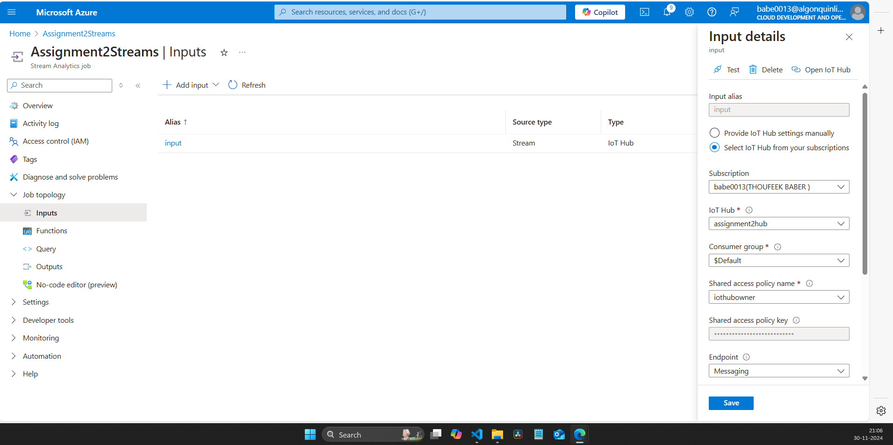
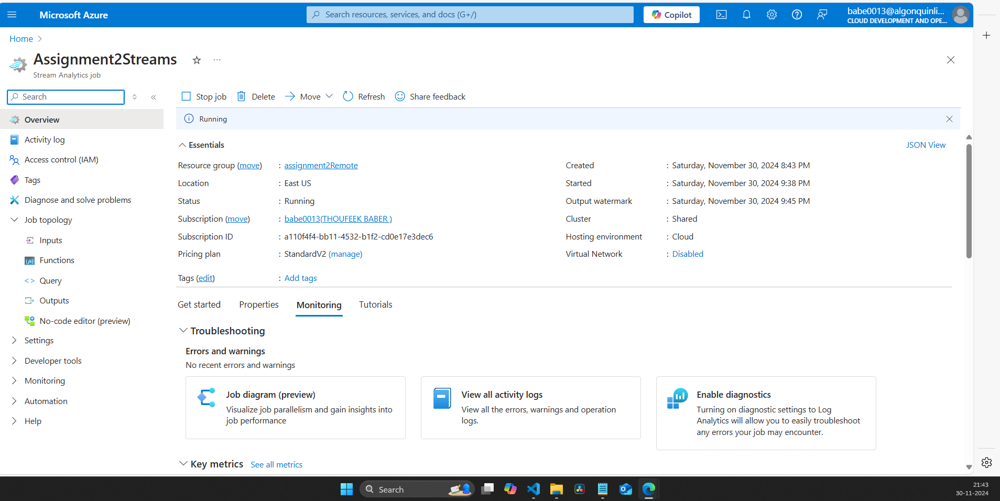

# Assignment 2 - Real-time Monitoring System for Rideau Canal Skateway

# Group 12
## Members
   - 1. Stefeena Vellachalil Benny (041154503)
   - 2. Akhil Jose (041171055)
   - 3. Thoufeek Baber (041166788)

## Table of Contents

1. [Overview](#overview)
2. [System Architecture](#system-architecture)
3. [Prerequisites](#prerequisites)
4. [Setting Up the Environment](#setting-up-the-environment)
    - [Install Dependencies](#1-install-dependencies)
5. [Creating Azure Resources](#creating-azure-resources)
    - [Create Azure IoT Hub](#step-1-create-azure-iot-hub)
    - [Configure Sensor Python Files](#step-2-configure-sensor-python-files)
    - [Create Azure Stream Analytics Job](#step-3-create-azure-stream-analytics-job)
    - [Create Azure Blob Storage](#step-4-create-azure-blob-storage)
6. [Running the IoT Sensor Simulation](#running-the-iot-sensor-simulation)
7. [Accessing Stored Data](#accessing-stored-data)
8. [Screenshots](#screenshots)
9. [Reflection](#reflection)

---

## Overview

### Scenario Description: Rideau Canal Skateway Monitoring

The **Rideau Canal Skateway**, a UNESCO World Heritage site in Ottawa, is the world’s largest outdoor skating rink, attracting thousands of skaters every winter. To ensure safety, the National Capital Commission (NCC) needs continuous monitoring of ice conditions, which can fluctuate due to weather changes. Currently, manual monitoring methods are not sufficient for real-time decision-making.

This project implements a **real-time monitoring system** using simulated IoT sensors at three key locations:

1. **Dow's Lake**
2. **Fifth Avenue**
3. **NAC**

This project aims to measure:

- **Ice Thickness** (in cm)
- **Surface Temperature** (in °C)
- **Snow Accumulation** (in cm)
- **External Temperature** (in °C)

The sensor data will be sent to **Azure IoT Hub**, processed through **Azure Stream Analytics**, and stored in **Azure Blob Storage**. This system will help detect unsafe conditions, ensure skater safety, and allow the NCC to respond quickly to any hazards, improving both safety and operational efficiency. 

---

## System Architecture


*Figure the architecture designed for the project.*

### Data Flow:

1. **IoT Sensors**:
   These simulated sensors are deployed at three key locations along the Rideau Canal Skateway: **Dow's Lake**, **Fifth Avenue**, and **NAC** (National Arts Centre). Each sensor mimics real-world conditions by generating telemetry data at regular intervals (every 10 seconds). The data generated includes critical safety parameters such as **ice thickness**, **surface temperature**, **snow accumulation**, and **external temperature**. This data provides real-time insights into the environmental conditions along the canal and helps monitor skater safety.

2. **Azure IoT Hub**:
   **Azure IoT Hub** acts as the central hub for receiving real-time telemetry from the IoT sensors. It securely ingests the data sent by the sensors at Dow's Lake, Fifth Avenue, and NAC. IoT Hub enables bi-directional communication between the IoT devices and the cloud, ensuring that the data is transmitted reliably and securely. This step is crucial for ensuring data integrity and scalability, as IoT Hub can handle data streams from multiple sensors simultaneously.

3. **Azure Stream Analytics**:
   Once the data is ingested by IoT Hub, **Azure Stream Analytics** is used to process this incoming data in real-time. Stream Analytics applies SQL-like queries to the data to calculate key metrics such as **average ice thickness**, **maximum snow accumulation**, and other important safety indicators over a rolling 5-minute window. The processed data helps identify unsafe conditions, such as thin ice or excessive snow buildup, and enables timely alerts or actions.

4. **Azure Blob Storage**:
   After the data is processed by Azure Stream Analytics, the aggregated results are stored in **Azure Blob Storage**. Blob Storage provides a scalable, cost-effective solution for storing large amounts of structured and unstructured data. The processed telemetry data is stored in **JSON format**, allowing for easy access, querying, and further analysis by stakeholders, such as data analysts or public safety teams. The structured data in Blob Storage can also be used for historical analysis, trend detection, or reporting.

---

## Prerequisites

1. **Python**: Ensure Python 3.8 or higher is installed.
2. **Azure Account**: Set up a free or paid Azure account.
3. **Required Python Libraries**: Install dependencies using `requirements.txt`.

---

## Setting Up the Environment

### 1. Clone the git repo
Run the following command to clone the repo:
```bash
git clone <repo link>
```

#### 1.1 The folder structure should be following

```bash
├── 0_9eb59378dc1246578a88f388ce946b44_1.json
├── images
│   └── 1.png
├── README.md
├── requirements.txt
├── screenshots
│   ├── 1.png
│   ├── 2.png
└── sensor-simulation
    ├── sensor1_DOWS_Lake.py
    ├── sensor2_Fifth_Avenue.py
    └── sensor3_NAC.py
```


*Figure shows the folder structure inside the repo*


### 2. Install Dependencies
Run the following command to install the necessary libraries:
```bash
pip install -r requirements.txt
```

---

## Creating Azure Resources

### **Step 1: Create Azure IoT Hub**
1. Log in to the [Azure Portal](https://portal.azure.com).
2. Search for **IoT Hub** in the search bar and click **Create**.
3. Fill in the required details:
   - **Subscription**: Select your subscription.
   - **Resource Group**: Create a new one or select an existing one.
   - **Region**: Choose the region closest to your project.
   - **IoT Hub Name**: Provide a unique name.
4. Click **Review + Create** and then **Create**.

---


- 
   *Overview of IoT hub created for the project.*

5. After deployment, navigate to the IoT Hub and create a new **Device** under **IoT devices**.


- 
*Figure shows three sensors in the Iot Hub.*


6. Copy the **Device Connection String** from the device details page.

### **Step 2: Configure Sensor Python Files**
1. Open each sensor simulation file:
   - `sensor1_DOWS_Lake.py`
   - `sensor2_Fifth_Avenue.py`
   - `sensor3_NAC.py`
2. Locate the placeholder for the IoT Hub connection string:
   ```python
   CONNECTION_STRING = "PASTE_YOUR_CONNECTION_STRING_HERE"
   ```
3. Replace the placeholder with the connection string copied from Azure IoT Hub.

---

### **Step 3: Create Azure Stream Analytics Job**
1. Search for **Stream Analytics Job** in the Azure Portal and click **Create**.
2. Fill in the required details:
   - **Job Name**: Give your job a unique name.
   - **Region**: Use the same region as your IoT Hub.
   - **Streaming Units**: Start with 1 (adjust as needed).
3. Click **Review + Create** and then **Create**.

   - 
         *Figure shows the StreamAnalytics created for the project.*


4. After deployment:
   - Configure **Input**:
     - Type: IoT Hub.
     - Select the IoT Hub created earlier.
   - 
         *Figure shows the input created in the stream analytics.*

   
   - Configure **Output**:
     - Type: Blob Storage.
     - Provide the connection string and container details of your Azure Blob Storage.

   - 
         *Figure shows the output created in the stream analytics with connected blob storage and container.*

5. Input Data Preview
   - 
       *Figure shows data in the input preview from all three sensors containing location, ice thickness, surface temperature, snow accumulation, external temperature.*

   - Add **Query**:
     ```sql
     SELECT
       location,
       AVG(iceThickness) AS avgIceThickness,
       MAX(snowAccumulation) AS maxSnowAccumulation,
       System.Timestamp AS aggregationTime
     INTO
       [YourBlobOutputAlias]
     FROM
       [YourIoTHubInputAlias]
     GROUP BY
       location, TumblingWindow(Duration(minute, 5))
     ```


     > **Note**: Replace `YourBlobOutputAlias` with the name of the blob storage output you created for this project, and `YourIoTHubInputAlias` with the name of the IoT Hub input you configured.  

     - 
       *Figure shows successfull test query in stream analytics.*

---

### **Step 4: Create Azure Blob Storage**
1. Search for **Storage Account** in the Azure Portal and click **Create**.
2. Fill in the required details:
   - **Resource Group**: Use the same one as the IoT Hub.
   - **Storage Account Name**: Provide a unique name.
   - **Region**: Use the same region as your other resources.
3. Click **Review + Create** and then **Create**.
4. After deployment:
   - Navigate to **Containers** and create a new container (e.g., `processed-data`).
   - Note the container name for configuring the Stream Analytics job output.

   - 
       *Figure shows storage account and container created for this project.*

---

## Running the IoT Sensor Simulation

1. Navigate to the cloned repository:
   ```bash

   cd <path to folder>
   ```
2. Ensure that each sensor script (`sensor1_DOWS_Lake.py`, `sensor2_Fifth_Avenue.py`, `sensor3_NAC.py`) has the correct Azure IoT Hub **Device Connection String**.

3. Start the simulation in three seperate terminals :
   ```bash
   python3 sensor1_DOWS_Lake.py
   python3 sensor2_Fifth_Avenue.py
   python3 sensor3_NAC.py
   ```

### Running the Stream Analytics
1. Log in to the [Azure Portal](https://portal.azure.com).

2. Navigate to your **Stream Analytics Job** that was set up earlier.

3. Click on **Query** in the left-hand menu and ensure the query matches the one provided in the previous setup:

4. Save the query if it hasn’t been saved yet.

5. Start the Stream Analytics Job:
   - Click on the **Start** button at the top of the page.
   - Choose the **Job output start time** (default is "Now").
   - Confirm to start the job.

6. Monitor the job status and output:
   - Verify that the job status changes to **Running**.
   - Check the output in the blob storage configured earlier to ensure the results are being written as expected.


   - 
       *Figure shows starting of the stream analytics job inside azure portal.*

   - 
      *Figure shows successful running of the stream analytics job inside azure portal.*

---

## Accessing Stored Data

1. Navigate to your Blob Storage container in the Azure Portal.
2. Locate the JSON files generated by the Stream Analytics job.
3. Download the data.
4. Open in VScode analyze the data.

   - 
      *Figure shows json file inside the container generated by stream analytics job.*

 ### Data retreived from the container
 ```json
      {"location":"Dow's Lake","avgIceThickness":24.22699999999999,"maxSnowAccumulation":19.93,"aggregationTime":"2024-12-01T02:40:00.0000000Z"}
      {"location":"NAC","avgIceThickness":24.48103448275862,"maxSnowAccumulation":19.81,"aggregationTime":"2024-12-01T02:40:00.0000000Z"}
      {"location":"Fifth Avenue","avgIceThickness":25.908275862068976,"maxSnowAccumulation":19.98,"aggregationTime":"2024-12-01T02:40:00.0000000Z"}
 ```

   - 
      *Figure shows data inside the json file downloaded from the running stream analytics job containing all three location and the corresponding ice thickness and snow accumulation.*

---

## Reflection

By working on the **Real-time Monitoring System for the Rideau Canal Skateway**, we gained valuable insights into several key aspects of IoT and cloud technologies.

1. **Real-time Data Processing**: We learned how to set up and manage real-time data streams using **Azure Stream Analytics**. Through this, we were able to understand how to process telemetry data from IoT devices in real-time, enabling us to detect unsafe conditions such as thin ice or high snow accumulation quickly.

2. **Device Communication**: We gained hands-on experience with **Azure IoT Hub** for device-to-cloud communication. This included configuring device twins and managing device states, which helped us better understand how to maintain efficient and reliable communication between sensors and the cloud.

3. **Data Storage Management**: Working with **Azure Blob Storage** taught us how to handle large volumes of data efficiently. We learned how to store telemetry data for long-term use, implement data lifecycle policies, and optimize storage costs, ensuring that the system could scale as needed.

4. **System Integration**: We gained experience in integrating various cloud services to create a cohesive monitoring system. From setting up real-time data ingestion to implementing alert mechanisms, we learned how to connect different services and ensure smooth data flow.

Overall, this project taught us not only the technical details of building an IoT solution but also the importance of system design, scalability, and real-time data processing in safety-critical applications.

---

